# SHYU — 유성호

### Backend Engineer

느린 지점을 수치로 찾고, 데이터 흐름과 운영 환경까지 함께 개선합니다.
Java·Kotlin과 Spring을 중심으로 **성능, 데이터 정합성, 운영 안정성**을 고민합니다.

[포트폴리오](https://shyu-portfolio.pages.dev) · [이력서](https://shyu-portfolio.pages.dev/resume.pdf) · [이메일](mailto:shyu6370@gmail.com)

---

## About Me

- **“왜?”를 먼저 묻습니다.** 기능 구현에 그치지 않고 실행 계획과 로그를 살펴 실제 병목과 실패 원인을 찾습니다.
- **데이터가 흐르는 전체 과정을 봅니다.** 저장·검색·캐시·이벤트 전달 사이의 정합성과 책임을 함께 설계합니다.
- **운영까지 이어지는 개발을 지향합니다.** 배포, 관측, 장애 경계를 직접 확인하며 개선 결과를 검증합니다.
- **근거를 공유하며 협업합니다.** 복잡한 문제를 작은 계약과 리뷰 가능한 변경으로 나누고 선택의 이유를 기록합니다.

---

## Engineering Highlights

| 부하 검증 | 데이터 정합성 | 운영 환경 |
| --- | --- | --- |
| k6 100 VU·5분 **총 17,356건 · RPS 57.7 req/s · 오류율 0%** | Outbox·Debezium CDC로 이벤트 전달 흐름 표준화 | 로컬 VM 기반 **3-Node Kubernetes** 구축 |

---

## Selected Work

### 01. PawBridge

> 공공데이터 기반 유기동물 보호·입양 플랫폼

- Outbox와 Debezium CDC를 적용해 트랜잭션 이후 이벤트 전달 흐름을 정리했습니다.
- k6 100 VU·5분 동안 **총 17,356건의 요청**을 처리했고, **RPS 57.7 req/s·오류율 0%**를 확인했습니다.
- Kubernetes와 Prometheus·Grafana·Zipkin으로 배포와 관측 환경을 구성했습니다.

`Java` `Spring Boot` `MySQL` `Redis` `Elasticsearch` `Kafka` `Kubernetes`

[프로젝트 상세](https://shyu-portfolio.pages.dev/#project-pawbridge) · [운영 서비스](https://www.pawbridge.kr) · [GitHub](https://github.com/pawbridge/pawbridge-backend-k8s)

### 02. Ops Console

> ICT콤플렉스 기업 협업 실무 프로젝트 · 운영 업무 구조화

- 운영 용어와 정책을 코드의 책임으로 옮기는 도메인 설계를 진행하고 있습니다.
- Kotlin·Spring 기반에서 계층별 책임과 변경 경계를 분리합니다.
- 계약과 구현 근거를 리뷰 가능한 단위로 정리하며 협업합니다.

`Kotlin` `Spring Boot` `JPA` `DDD`

[프로젝트 상세](https://shyu-portfolio.pages.dev/#project-ops-console)

### 03. 샛별

> AI 모의면접 서비스 · 응답 지연과 LLM 호출 흐름 개선

- 면접 처리 흐름을 병렬화하고 배치 평가로 전환해 사용자 대기 시간을 줄였습니다.
- 중복 문맥 처리 단계를 정리해 LLM 호출을 **21회에서 11회**로 줄였습니다.

`Java` `Spring Boot` `Python` `FastAPI` `LLM`

[프로젝트 상세](https://shyu-portfolio.pages.dev/#project-starlight)

---

## Tech Stack

### Backend

### Data & Messaging

### Infra & Observability

### Testing & Supporting

---

## GitHub Activity

<picture>
  <source media="(prefers-color-scheme: dark)" srcset="./profile-summary-card-output/github_dark/0-profile-details.svg">
  <source media="(prefers-color-scheme: light)" srcset="./profile-summary-card-output/github/0-profile-details.svg">
  
</picture>

---

## Working Principles

- 추측보다 실행 계획과 로그로 병목을 확인합니다.
- 기능 구현에서 끝내지 않고 실패 경계와 운영 상태까지 살핍니다.
- 복잡한 문제를 작은 계약과 검증 가능한 변경으로 나눕니다.

더 자세한 문제 해결 과정은 [포트폴리오](https://shyu-portfolio.pages.dev)에서 확인할 수 있습니다.
